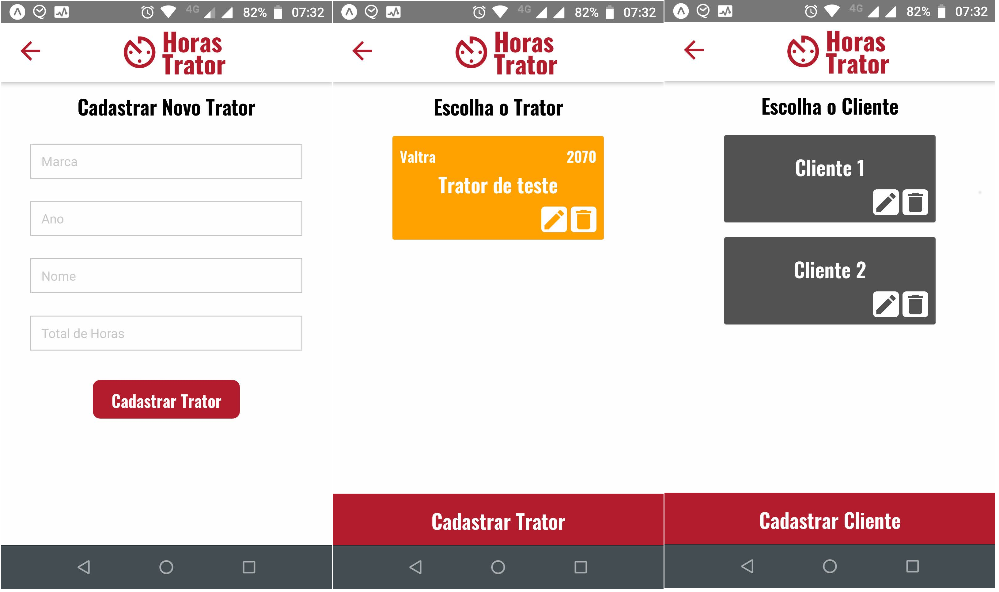

<h1 align="center">Horas Trator</h1>

### :construction: Em Desenvolvimento.....



## :art: Design
<a href="https://www.figma.com/file/3hBW172KZGEPSMlgBSpmlN/Horas-Trator?node-id=0%3A1">Figma Link</a>


## :information_source: How To Use

```bash
# Install dependencies
$ yarn install

# start app
$ yarn start

```
